# Open Issue List 使用手册

> 汽车行业 IATF 16949 / 8D 标准议题追踪系统

## 快速开始

```bash
pnpm run dev     # 启动 server(:3400) + web(:5181)
```

默认演示账号：`admin` / `zhangsan` / `lisi`，密码均为 `123456`。

首次启动后进入仪表盘，点击「🗂️ 创建演示数据」可一键生成示例，快速体验完整功能。

---

## 典型使用场景

### 场景一：个人点检表

> 比如杨腊梅需要一份自己的日常点检清单，自己管理、自己使用。

1. **创建列表**：仪表盘 → `+ 新建列表` → 名称填"杨腊梅的点检表"，类型选"自定义"
2. 创建者自动是 owner（所有者），自己一个人用，不需要额外添加成员
3. **新建 Issue**：进入列表 → `+ 新建 Issue` → 填写检查条目（如"检查设备A温度"）
4. **添加点检**：点击 Issue 进入详情 → `+ 添加点检` → 填写日期、描述、负责人
5. **日常使用**：每天打开列表，对点检项标记"完成"或"未完成"

### 场景二：小组点检表

> 测试组需要一份公共点检表，加入杨腊梅、宋蕾、林芝彤三人。

1. **创建列表**：仪表盘 → `+ 新建列表` → 名称填"测试组组点检"，类型选"月度"
2. **添加成员**：进入列表 → 点击「👥 成员」按钮 → 依次添加杨腊梅、宋蕾、林芝彤
   - 角色选 **编辑者**（可新建/编辑 Issue）或 **观察者**（只能查看）
3. **新建 Issue**：各成员在列表中创建自己负责的检查条目
4. **分配责任人**：创建 Issue 时指定负责人，明确谁负责处理

### 场景三：个人点检推送到小组

> 杨腊梅在自己的点检表中发现问题，需要推到测试组公共点检表。

1. 在杨腊梅的个人点检表中，找到需要推送的 Issue
2. 点击该 Issue 行右侧的 📤 图标（或进入详情页点「推送」）
3. 选择目标列表"测试组组点检"
4. 目标列表负责人收到推送审批通知
5. 审批通过后，该 Issue 出现在测试组公共点检表中

> 💡 推送是**复制**而非移动，两个列表各自保留独立副本，可分别更新。

---

## 基本概念

### Issue List（议题列表 / 点检表）

按年/月/项目组织的议题集合。每个列表有独立的成员和权限。

| 类型 | 说明 | 示例 |
|------|------|------|
| 年度 (`yearly`) | 年度检查计划 | 2026年度质量点检 |
| 月度 (`monthly`) | 月度常规检查 | 2026年7月点检 |
| 项目 (`project`) | 特定项目跟踪 | 新车型Q-2026-001 |
| 自定义 (`custom`) | 个人或临时列表 | 杨腊梅的点检表 |

### Issue（议题）

单个问题条目，包含 21 个汽车行业标准字段（严重度、分类、发现阶段、8D 报告等）。

### Checkpoint（点检）

每个 Issue 下的时间线节点，记录检查日期、描述、负责人和完成状态。逾期未完成的点检会自动红色高亮。

### 推送

将 Issue 从一个列表复制到另一个列表（如个人→小组、小组→科室）。需双方有共同成员，目标列表负责人审批后生效。

---

## 仪表盘

登录后首先看到的页面。

- **视图切换**：👤 我的 / 🌐 所有 / 📦 归档
- **列表卡片**：展示名称、类型标签、负责人、成员数、更新时间
- **点击卡片**：进入该列表的 Issue 管理页
- **📦 按钮**：归档列表（从默认视图隐藏，可在「归档」视图找回）
- **+ 新建列表**：创建新列表
- **🗂️ 创建演示数据**：一键生成示例数据（已有数据时会跳过）

---

## 列表操作
### 列表查看
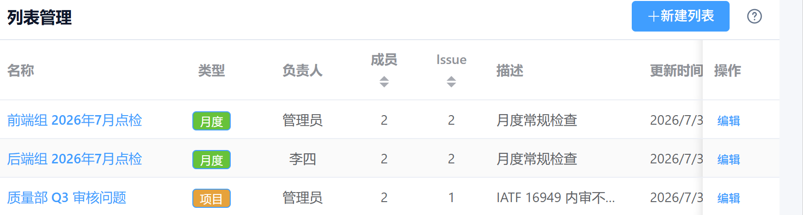

### 创建列表

仪表盘 → `+ 新建列表` → 填写：

| 字段 | 说明 | 必填 |
|------|------|------|
| 名称 | 如"测试组组点检" | ✅ |
| 类型 | 年度 / 月度 / 项目 / 自定义 | ✅ |
| 描述 | 补充说明（可选） | — |
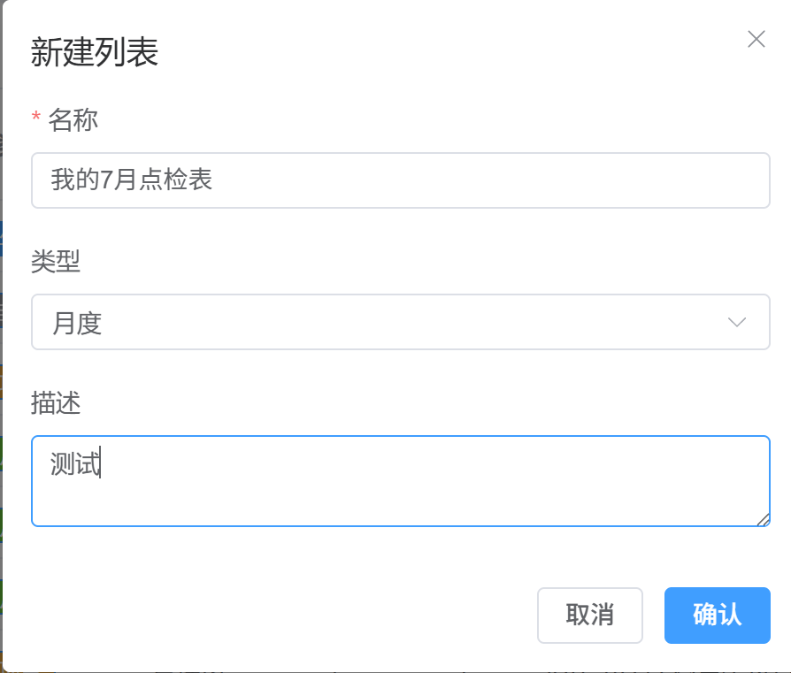
### 查看列表：三种视图

进入列表后可切换视图模式：

| 视图        | 用途       | 显示列                             |
| --------- | -------- | ------------------------------- |
| 📋 简单     | 点检会议快速扫视 | #, 标题, 严重度, 优先级, 责任人, 计划完成日, 状态 |
| 📋📋 复杂   | 审计追溯     | + 分类, 发现阶段, 提出人                 |
| 📋📋📋 跟踪 | 跟踪讨论过程   | + 最近 3 条点检（右侧锁定列）               |
- 简单模式
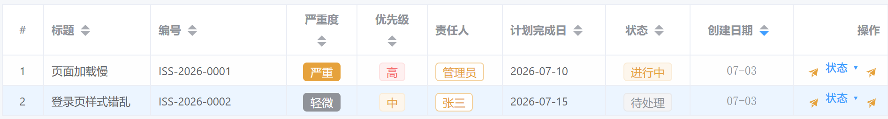

- 复杂模式
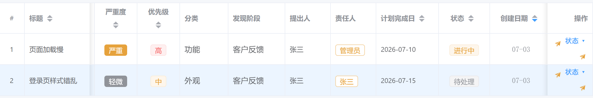
- 跟踪模式：
  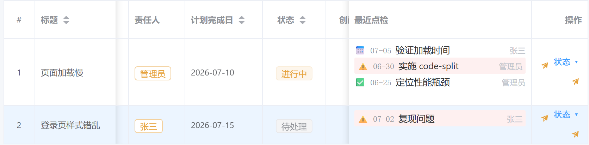
### 筛选和排序

列表页支持：
- **状态筛选**：待处理 / 进行中 / 已解决 / 已关闭 / 已取消
- **严重度筛选**：致命 / 严重 / 一般 / 轻微
- **分类筛选**：外观 / 尺寸 / 功能 / 过程 / 安全 / 其他
- **文本搜索**：按标题模糊搜索
- **列头排序**：点击列头可升降序排列

### 成员管理

列表页 → `👥 成员` 按钮 → 管理成员

**角色与权限：**

| 角色 | 权限说明 |
|------|----------|
| **owner**（所有者） | 完全控制：编辑列表、管理成员、删除列表 |
| **admin** | 管理成员、编辑列表设置 |
| **editor**（编辑者） | 新建/编辑/删除 Issue、添加点检 |
| **reporter** | 新建 Issue、添加点检 |
| **viewer**（观察者） | 只读查看，不能修改 |

> 创建者自动成为 owner。个人点检表不需要额外添加成员。小组点检表建议将组员加为 editor。

### 归档 / 编辑 / 删除列表

- **归档**：列表页 → 编辑 → 勾选「归档」→ 从仪表盘默认隐藏
- **编辑**：列表页 → 编辑按钮 → 修改名称、描述
- **删除**：列表页 → 删除按钮（需确认，会级联删除列表下所有 Issue 和点检）

---

## Issue 操作

### 新建 Issue

列表页 → `+ 新建 Issue` → 填写：

| 字段 | 说明 | 可选值 |
|------|------|--------|
| **标题** | 必填 | — |
| **严重度** | 问题严重程度 | 致命 / 严重 / 一般 / 轻微 |
| **优先级** | 处理优先级 | 低 / 中 / 高 / 紧急 |
| **问题分类** | 问题类别 | 外观 / 尺寸 / 功能 / 过程 / 安全 / 其他 |
| **发现阶段** | 在哪个环节发现 | 来料检验 / 过程检验 / 终检 / 客户反馈 / 审核发现 / 供应商端 |
| **提出人** | 谁提出的 | 从用户列表选择 |
| **责任人** | 谁负责处理 | 从用户列表选择 |
| **计划完成日** | 截止日期 | YYYY-MM-DD |

### 查看 Issue

点击列表行 → Issue 详情页，展示：

- **基本信息**：标题、状态、严重度、优先级、分类等
- **人员与日期**：提出人、责任人、计划完成日、实际完成日
- **关闭信息**：关闭理由、关闭人
- **8D 报告**：D3 遏制措施 / D4 根因分析 / D5-D6 纠正措施
- **描述**：详细描述
- **点检时间线**：所有点检记录，按日期排列
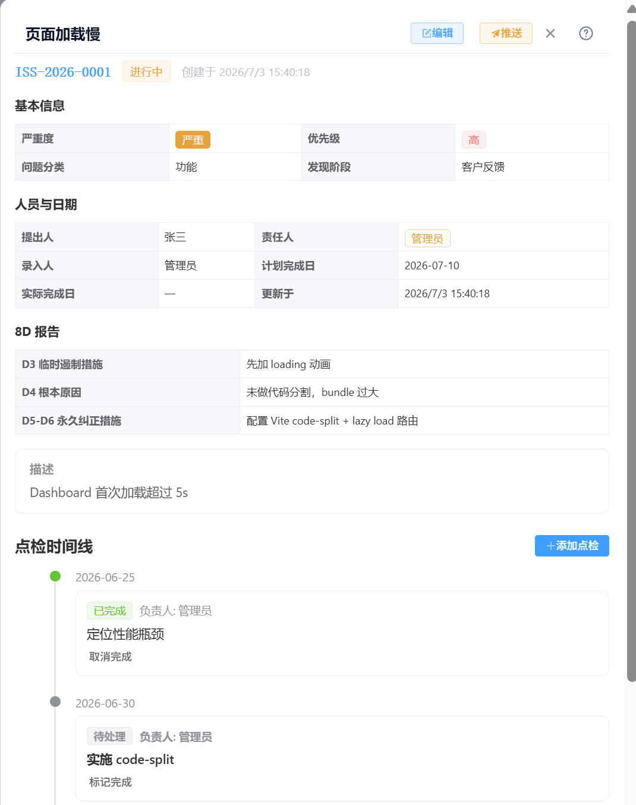
### 变更状态

列表行 → `状态 ▾` 下拉 → 选择目标状态：

```
待处理 → 进行中 → 已解决 → 已关闭
  ↓                  ↓
已取消            （不可逆）
```

- **📄 作废**：在状态下拉底部，点击后确认，Issue 在当前列表隐藏（数据保留）
- **🔄 恢复**：已作废的 Issue 状态下拉显示「恢复」，点击即可恢复
- 勾选「显示已作废」可查看已作废的 Issue（半透明区分）
- **🗑 删除**：暂禁用（点击提示"临时禁用"）

### 推送 Issue

- **列表行**：点击 📤 图标 → 选择目标列表 → 确认
- **详情页**：点击「推送」按钮 → 选择目标列表 → 确认

推送条件：双方列表有共同成员，目标列表有可审批的成员。
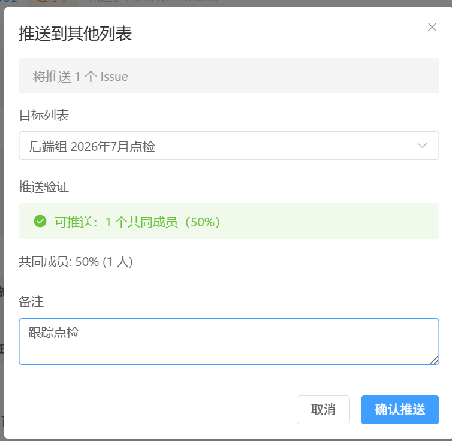
### 编辑 / 作废 / 删除 Issue

- **编辑**：详情页 → 编辑按钮 → 修改字段 → 保存
- **作废**：列表行 → `状态 ▾` → `📄 作废` → 确认（仅当前列表隐藏，数据保留）
- **恢复**：勾选「显示已作废」→ 找到作废行 → `状态 ▾` → `🔄 恢复`
- **删除**：暂禁用中
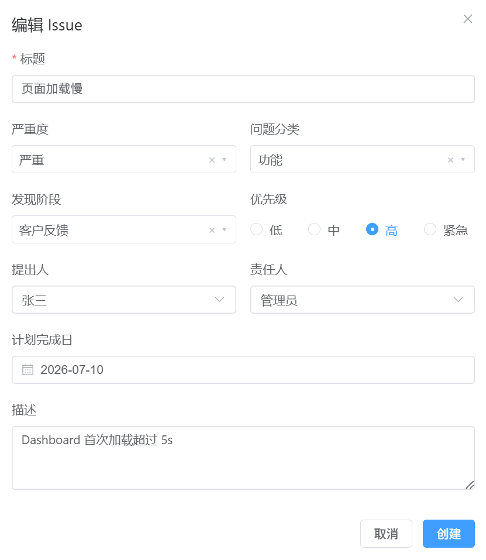
---

## 点检操作

### 添加点检

Issue 详情页 → `+ 添加点检` → 填写：

| 字段 | 说明 |
|------|------|
| 日期 | 点检日期（逾期未完成会高亮） |
| 描述 | 检查内容描述 |
| 负责人 | 谁负责执行点检 |
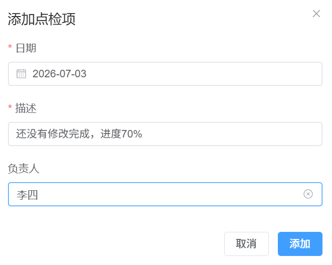
### 标记完成 / 取消完成

- 点检项 → 点击「✓ 标记完成」→ 状态变为已完成（绿色）
- 再次点击可「取消完成」恢复为待处理

### 删除点检

点检项 → 🗑️ 按钮 → 确认删除。

### 逾期提醒

点检日期已过且状态仍为"待处理"的项，会以**红色高亮**显示。

---

## 推送审批

### 发起推送（推送方）

1. 在 Issue 详情页或列表行点击「推送」
2. 选择目标列表
3. 确认推送
4. Issue 以"待审批"状态进入目标列表

### 审批推送（接收方）

目标列表页出现黄色提示条，显示待审批数量：

1. 点击「推送收件箱」查看待审批推送
2. 对每条推送选择：
   - **接受** → Issue 复制到本列表，可正常使用
   - **拒绝** → 填写理由，Issue 不会进入本列表
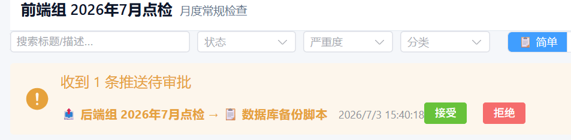
也可以在「推送历史」页面统一查看和审批所有推送。
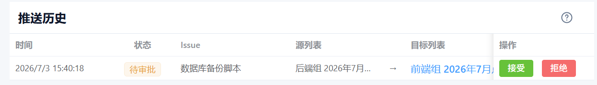
---

## 组织架构

导航 → 「组织架构」页面 → 树形展示：

- **全部人员**（根节点）：汇总所有组织的人员
- **部门 (division)**：如研发部、质量部
- **小组 (group)**：如前端组、后端组

支持操作：
- 点击节点 → 查看该组织下的成员列表
- 新建 / 编辑 / 删除组织节点
- 将用户分配到具体组织
- 审批新注册用户（从待定组批准）

新注册用户自动归入「待定组」，管理员在组织架构中调整归属并审批。

---

## 数据字典（设置）

导航 → 「设置」页面 → 管理系统中的下拉选项：

| 字典分组 | 说明 |
|----------|------|
| 问题分类 | Issue 的分类选项 |
| 发现阶段 | 发现环节选项 |
| 组织类型 | 组织层级选项 |
| 严重度 | 严重度选项 |
| 关闭理由 | 关闭理由选项 |

操作：
- **🚗 汽车默认值**：一键追加 IATF 16949 行业标准预设
- **💻 软件默认值**：一键追加软件行业预设
- **+ 添加**：自定义新的下拉选项
- **🗑 删除一类值**：按标签（汽车/软件）批量删除该类所有字典项，无引用的删除、有引用的跳过
- **启用/禁用**：控制选项是否在下拉菜单中出现
- **删除**：移除单个选项（已被 Issue 使用的项无法删除）

---

## 用户注册

登录页 → `没有账号？去注册` → 填写用户名、邮箱、密码、显示名。

新用户注册后需管理员审批才能登录。管理员在「组织架构」页面审批用户并分配组织归属。

---

## 核心算法测试

导航栏 `🧪 测试` → 运行 23 条单元测试：

| 分类 | 数量 | 测试内容 |
|------|------|----------|
| 权限 | 8 条 | 角色 CRUD 权限验证 |
| 推送 | 8 条 | 推送创建、审批、拒绝流程 |
| 调度 | 7 条 | 逾期检测、状态流转 |

---

## 快捷键

| 操作 | 说明 |
|------|------|
| 点击列表卡片 | 进入列表 |
| 点击表格行 | 进入 Issue 详情 |
| `返回` / 浏览器后退 | 回到上一页 |
| 点击 `?` 帮助按钮 | 查看当前页面功能说明 |
| 点击「本页导引」 | 页面功能位置巡游 |

---

## 常见问题

### Q: 个人点检表和小组点检表有什么区别？

本质上都是 Issue List，区别在于：
- **个人**：只加自己（创建者即 owner），其他人看不到
- **小组**：添加多个成员（如测试组全员），每个人都能看到和操作

### Q: 怎么把个人点检的内容推到小组？

使用「推送」功能。在自己的列表中点击 Issue 的 📤 图标，选择目标小组列表即可。

### Q: 推送后原列表的 Issue 会消失吗？

不会。推送是**复制**，不是移动。两个列表各自保留独立副本，可以分别更新。

### Q: 点检逾期了怎么提醒？

逾期点检项会自动以红色高亮显示。在「跟踪」视图（📋📋📋）中可以看到每个 Issue 最近的点检状态。

### Q: 怎么重置所有数据重新开始？

删除 `data/open-issue.sqlite` 文件后重启服务，数据库会自动重建。然后进入仪表盘点击「创建演示数据」即可。
